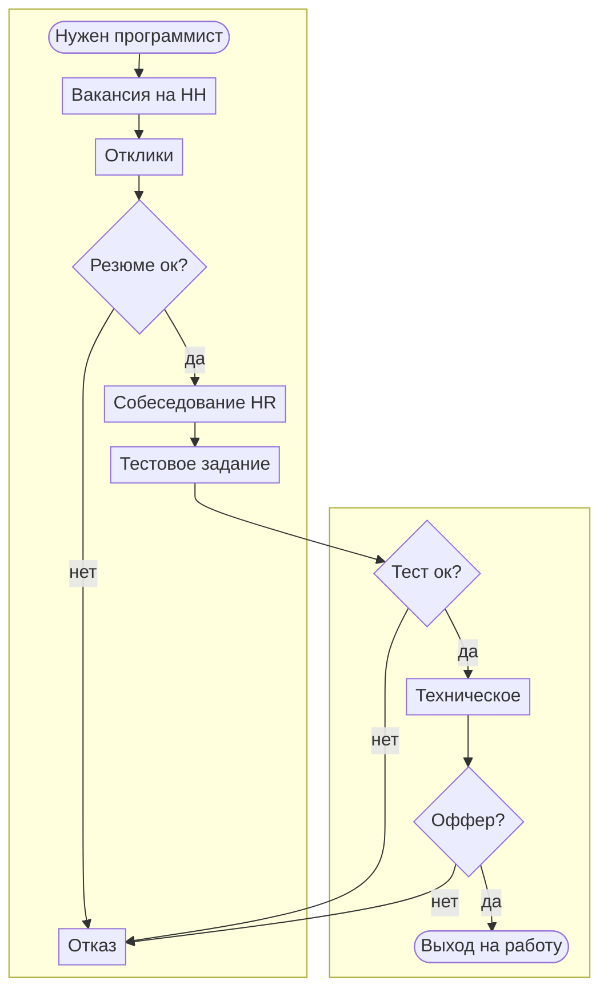

```mermaid
%%{init: {"flowchart": {"nodeSpacing": 18, "rankSpacing": 22, "padding": 4}} }%%
flowchart TB
    subgraph row1[" "]
        direction LR
        start([Нужен программист]) --> vac[Вакансия на HH] --> inbox[Отклики]
        inbox --> cv{Резюме ок?}
        cv -->|нет| reject[Отказ]
        cv -->|да| hr[Собеседование HR]
        hr --> task[Тестовое задание]
    end
    subgraph row2[" "]
        direction LR
        task --> check{Тест ок?}
        check -->|нет| reject
        check -->|да| tech[Техническое]
        tech --> offer{Оффер?}
        offer -->|нет| reject
        offer -->|да| hire([Выход на работу])
    end
```
